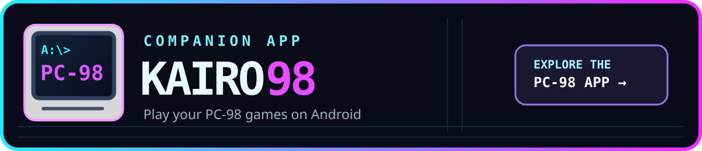

# KairoDos

KairoDos is an independent Android DOS emulator using [DOSBox Staging](https://www.dosbox-staging.org/). It offers a game library, controller and touch mapping, an on-screen keyboard, and per-game settings. The audited emulator source is copied into this project.

[Kairo98](https://github.com/MrJackSpade/Kairo98) is the companion PC-98 emulator. Both apps use the [Kairo shared frontend](https://github.com/MrJackSpade/Kairo) for the library, navigation, and controls.

## Add games

Choose a DOS game folder from the library menu, then select a game and tap **Play**. KairoDos prepares a persistent writable DOS drive in private app storage, leaving your original archives intact. Games and proprietary operating system files are not bundled. ZIP/DOSZ archives, programs and game folders are supported; standalone media support follows Staging (ISO/CUE and IMG/IMA, rather than Pure's CHD/JRC formats).

Known games receive a title, description, tags, and artwork from a hash-keyed catalog seeded from eXoDOS metadata. Your games do not need to be in an eXoDOS directory. An unknown game appears by filename and can still launch. See [catalog behavior](docs/catalog.md).

An eXoDOS source ZIP is detected by its empty `.exo` marker, even without a catalog entry, and appears with ` - Installer` in the library. On first launch, KairoDos creates and verifies an installed ZIP in the writable selected folder, then offers to remove the installer. You can keep it. If an external frontend grants access to only one ZIP, the installed copy goes into private app storage. Game writes go to the persistent Staging drive. Existing Pure overlay files are preserved while ordinary in-game saves are imported once.

ARM64 dynamic recompilation is enabled for default/auto CPU profiles in both real and protected modes. Explicit interpreter and prefetch CPU compatibility settings are preserved.

Staging does not support emulator save states. Use a game's own save system. Existing Pure state files stay on disk but cannot be loaded in Staging.

To remove a game file or game folder from device storage, open its **Game settings** and choose **Delete game file** or **Delete game folder**. KairoDos names the source in a confirmation before deleting it. Saves and settings are kept.

Some eXoDOS launchers require companion programs or features of other emulators. These may need manual setup.

## External frontends

Use the [external frontend setup guide](docs/frontends.md) to launch KairoDos games from other apps:

- [LaunchBox for Android](docs/frontends.md#launchbox-for-android)
- [ES-DE](docs/frontends.md#es-de)

## Build and source

Clone with `git clone --recurse-submodules https://github.com/MrJackSpade/KairoDos.git`. Run `pwsh tools/PrepareStagingDependencies.ps1` before `./gradlew :kairodos:assembleDebug`. The build uses JDK 17, Android SDK 36, NDK 28.2.13676358, CMake 3.22.1 and ARM64. See [Windows instructions](docs/build-windows.md).

First-party KairoDos and Kairo frontend code is [GPL-2.0-or-later](COPYING). See [source provenance](docs/source-import.md) and [licensing](docs/licensing.md). Free GitHub and paid Google Play editions must have the same features and behavior from the same revision.
